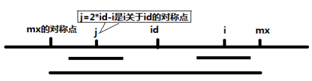
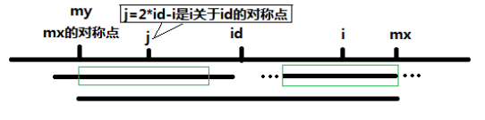

# 《编程之法：面试和算法心得》读书笔记

#### 算法1.1：旋转字符串

- 题目描述

	给定一个字符串，要求把字符串前面的若干个字符移动到字符串的尾部，如把字符串“abcdef”前面的2个字符'a'和'b'移动到字符串的尾部，使得原字符串变成字符串“cdefab”。请写一个函数完成此功能，要求对长度为n的字符串操作的时间复杂度为 $O(n)$，空间复杂度为 $O(1)$。

- 分析与解法

> 解法一：暴力移位法

```c
// 算法1.1：旋转字符串，暴力移位法
void LeftShiftOne(char* strs, int number)
{	
	int i = 0;
	char ch = strs[i];
	for(i = 1; i < number; i++)
	{
		strs[i-1] = strs[i];
	}
	strs[i-1] = ch;
}


void LeftRoatateString(char* strs, int n, int m)
{
	while(m--)
	{
		LeftShiftOne(strs, n);
	}
}

// 测试函数
int main(int argc, char* argv[])
{	
	char strs[] = "ABCDEFGH";
	LeftRoatateString(strs, 8, 3);
	cout << strs << endl;
	return 0;
}
```

>> 算法分析：针对长度为n的字符串而言，假设需要移动m个字符到字符串的尾部，总共需要移动 `m*n` 次操作，同时设立一个变量存储第一个字符，故时间复杂度为 $O(n^2)$，空间复杂度为 $O(1)$，不合题意。

> 解法二：三步反转法

>> 思路分析：将一个字符串分成X和Y两部分，在每个部分字符串上定义反转操作，如$X^T$，即把X的所有字符反转（例如X="abc"，则 $X^T$="cba"），于是得到：$(X^T Y^T)^T$=$YX$。

```c
// 算法1.1：旋转字符串，三步反转法
void ReverseString(char* str, int from, int to)
{
	while(from < to)
	{
		char ch = str[from];
		str[from++] = str[to];
		str[to--] = ch;
	}
}


void LeftReverseString(char* strs, int n, int m)
{
	m %= n;
	ReverseString(strs, 0, m-1);
	ReverseString(strs, m, n-1);
	ReverseString(strs, 0, n-1);
}

// 测试函数
int main(int argc, char* argv[])
{	
	char strs[] = "ABCDEFGH";
	LeftReverseString(strs, 8, 3);
	cout << strs << endl;
	return 0;
}

```

>> 算法分析：针对长度为n的字符串而言，假设需要移动m个字符到字符串的尾部，总共需要移动 `2*n` 次操作，同时设立一个变量存储第一个字符，故时间复杂度为 $O(n)$，空间复杂度为 $O(1)$，符合题意。

- 练习题

>> 1. 链表翻转。例如给出一个链表和一个数k，链表为1—>2—>3—>4—>5—>6，k=2，则翻转后为2—>1—>6—>5—>4—>3；若k=3，翻转后3—>2—>1—>6—>5—>4。
>> 2. 编写程序在原来字符串中把字符串尾部的m个字符移动到字符串的头部，要求：长度为n的字符串操作时间复杂度为 $O(n)$，空间复杂度为 $O(1)$。例如，源字符串为 “Ilovebaofeng”，m=7时输出为：“baofengIlove”。
>> 3. 单词翻转。输入一个英文句子，翻转句子中单词的顺序，但是单词内字符的顺序不变，句子中单词以空格符号隔开。为简单起见，标点符号和普通字符一样处理。例如，输入"I am a student."，输出为 “student. a am I”。


#### 算法1.2：字符串包含

- 题目描述

	给定两个分别由字母组成的字符串A和字符串B，字符串B的长度比字符串A短。请问，如何快速地判断字符串B中的所有字符是否都在字符串A里面？
为简单起见，我们规定输入的字符串只包含大写英文字母，请实现函数 bool StringContain(string &A, string &B)。
示例一：string 1：ABCD，string 2： BAD，答案为true；
示例二：string 1：ABCD，string 2： BCE，答案为false；
示例三：string 1：ABCD，string 2： AA，答案为true。

- 分析与解法

> 解法一：常规解法

```c
// 算法1.2：字符串包含，常规方法
bool StringContain(string &a, string &b)
{
	for(int i=0; i < b.length(); i++)
	{
		int j;
		for(j=0; (j < a.length()) && (a[j] != b[i]); j++);
		if(j >= a.length())
		{
			return false;
		}
	}
	return true;
}
```

>> 算法分析：这是一种最直观也是最简单的方法思路。此算法需要 $O（n*m）$ 次操作，时间开销较大。

> 解法二：排序方法

```c
// 算法1.2：字符串包含，排序方法
bool StringContainSort(string &a, string &b)
{
	sort(a.begin(), a.end());   // 包含于<algorithm>模块内
	sort(b.begin(), b.end());
	for(int pa = 0, pb = 0; pb < b.length(); pb++)
	{
		while((pa < a.length()) && (a[pa] < b[pb]))
		{
			pa++;
		}
		if(pa >= a.length() || (a[pa] > b[pb]))
		{
			return false;
		}
	}
	return true;
}
```

>> 算法分析：算法分析：两个字符串的排序需要（常规情况）$O(m log m)+O(n log n)$ 次操作（快排算法），然后需要线性扫描 $O(m+n)$ 次操作。

> 解法三：转换成素数

>> 思路分析：
>>> 1）假定有一个仅由字母组成的字符串，按照从小到大的顺序，让每个字母与一个素数唯一对应，即用26个素数分别对应于`A`~`Z`；
>>> 2）遍历长字符串。求得每个字符对应素数的乘积；
>>> 3）遍历短字符串，判断乘积能否被短字符串中的字符对应的素数整除；
>>> 4）输出结果。

```c
// 算法1.2：字符串包含，转换成素数
bool StringContainPrime(string &a, string &b)
{
	const int array[26] = {2, 3, 5, 7, 11, 13, 17, 19, 23, 29, 31, 37, 41, 
		43, 47, 53, 59, 61, 67, 71, 73, 79, 83, 89, 97, 101};
	int f = 1;
	for(int i = 0; i < a.length(); i++)
	{
		int x = array[a[i] - 'A'];
		if(f % x)
		{
			f *= x;
		}
	}
	
	for(int j = 0; j < b.length(); j++)
	{
		int x = array[b[j] - 'A'];
		if(f % x)
		{
			return false;
		}
	}
	return true;
}
```

>> 算法分析：算法的时间复杂度为 $O(n)$ ，最好的情况为 $O(1)$（遍历短的字符串的第一个数，与长字符串素数的乘积相除，即出现余数，便可退出程序，返回 `false`）， `n` 为长字串的长度，空间复杂度为 $O(1)$。
>> **注意**：此方法只有理论意义，因为整数乘积很大会造成溢出风险。

> 解法四：`Hashtable`方法

>> 思路分析：先把长字符串 `A`中的所有字符都放入一个 `Hashtable` 里，然后轮询短字符串 `B`，看
短字符串 `B` 的每个字符是否都在 `Hashtable` 里，如果都存在，说明长字符串 `A` 包含短字符串 `B`，
否则，说明不包含。

```c
// 算法1.2：字符串包含，Hashtable方法
bool StringContainHash(string &a, string &b)
{
	int hash = 0;
	for(int i = 0; i < a.length(); i++)
	{
		hash |= (1 << (a[i] - 'A'));
	}
	
	for(int j = 0; j < b.length(); j++)
	{
		if(hash & (1 << (b[j] - 'A')))
		{
			return false;
		}
	}
	return true;
}
```

>> 算法分析：此方法实质是用一个整数代替了`Hashtable`，空间复杂度为 $O(1)$，时间复杂度为 $O(n + m)$。

- 练习题

>> 变位词：如果两个字符串的字符一样，但是顺序不一样，被认为是兄弟字符串，比如 `bad` 和 `adb` 即为兄弟字符串，现提供一个字符串，如何在字典中迅速找到它的兄弟字符串，请描述数据结构和查询过程。

#### 算法1.3：字符串转换成整数

- 题目描述

	输入一个由数字组成的字符串，把它转换成整数并输出。例如:输入字符串“123”，输出整数为123。给定函数原型 `int StrToInt(const char *str)`，实现字符串转换成整数的功能，不能使用库函数`atoi`。

- 分析与解法

>> 思路分析：当扫描字符串的第一个字符“1“时，由于是第一位，故得到数字1；继续向后扫描到第二个字符”2“，之前已经得到数字1，在其后添加一个数字2，得到数字12，相当于前面的数字扩大了10倍然后加上刚扫描到的数字2，即：1×10+2=12。同理，扫描到第三个字符”3“，即可得到最终整数123为所求。故而，其**基本思路**就是：从左至右扫描字符串，把之前得到的数字乘以10，再加上当前字符表示的数字。 但是，在处理过程中，需要考虑以下问题：
>>> 1）空指针的输入：输入的是指针，在访问空指针时程序会崩溃，需要提前判空；
>>> 2）正负符号：整数不仅包括数字，还有可能包括以“+”或“-”开头表示正负整数，遇到负号“-”需要做转换；
>>> 3）非法字符：输入的字符串中可能有不是数字的字符（如误操作其他字符），需要预先判断，碰到非法字符程序应停止转换；
>>> 4）整型溢出：输入的数字是以字符串的形式输入，若输入一个很长的字符串可能导致溢出。

```c
// 算法1.3：字符串转成整数
int StrToInt(const char* str)
{
	static const int MAX_INT = (int)((unsigned)~0 >> 1);
	static const int MIN_INT = -(int)((unsigned)~0 >> 1);
	unsigned int n = 0;

	// 判空
	if(str == 0)
	{
		return 0;
	}

	// 处理空格
	while(isspace(*str))
	{
		++str;
	}
	
	// 处理正负
	int sign = 1;
	if(*str == '+' || *str == '-')
	{
		if(*str == '-')
		{
			sign = -1;
		}
		str++;
	}

	while(isdigit(*str))
	{
		int c = *str - '0';
		if(sign > 0 && (n > MAX_INT/10 || (n == MAX_INT/10 && c > MAX_INT%10)))
		{
			n = MAX_INT;
			break;
		}
		else if(sign < 0 && (n > (unsigned)MIN_INT/10 || (n == (unsigned)MIN_INT/10 && c > (unsigned)MIN_INT%10)))
		{
			n = MIN_INT;
			break;
		}
		
		n = n *10 + c;
		str++;
	}
	return sign > 0 ? n:-n;
}
```

>> 算法分析：此算法难点在于处理数据溢出，其时间复杂度为 $O(n)$。

- 练习题

>> 实现 `string` 到 `double` 的转换。

#### 算法1.4：回文判断

- 题目描述

	回文(`palindrome`)，指一个顺着读和反过来读都一样的字符串，比如 `madam`、我爱我，这样的短句在智力性、趣味性和艺术性上都颇有特色，中国历史上还有很多有趣的回文诗。请编写一个函数实现如下功能：判断一个字串是否是回文？
	
- 分析与解法

> 解法一：首尾向中间扫描字符串

>> 思路分析： 同时从字符串头尾开始向中间扫描字串，如果头尾指向所有字符都相同，那么这个字串就是一个回文。采用这种方法的话，我们只需要维护头部和尾部两个扫描指针即可。

```C
// 算法1.4：回文判断，首尾向中间扫描字符串
bool IsPalindrome(const char *s, int n)
{
	if(s == NULL || n < 1)
	{
		return false;
	}

	const char *front, *back;
	front = s;
	back = s + n - 1;
	while(front < back)
	{
		if(*front != *back)
		{
			return false;
		}
		++front;
		--back;
	}
	return true;
}
```

>> 算法分析：这是一个直白且效率不错的实现，时间复杂度为$O(n)$，空间复杂度为$O(1)$。

> 解法二：中间向首尾扫描字符串

>> 思路分析： 同时从中间向前后两边开始扫描字串，如果前后指向所有字符都相同，那么这个字串就是一个回文。

```c
// 算法1.4：回文判断，中间向首尾扫描字符串
bool IsPalindromeMid(const char *s, int n)
{
	if(s == NULL || n < 1)
	{
		return false;
	}

	int front, back;
	int m = ((n >> 1) - 1) >= 0 ? (n >> 1) -1 :0; // middle point
	front = m;
	back = n - 1 - m;
	while(front >= 0)
	{
		if(s[front--] != s[back++])
		{
			return false;
		}
	}
	return true;
}
```

>> 算法分析：此算法时间复杂度为$O(n)$，空间复杂度为$O(1)$。

- 练习题

>> 1. 判断一个单向链表是不是回文？
>> 2. 判断一个栈是不是回文？ 

#### 算法1.5：回文判断

- 题目描述

	给定一个字符串，求它的最长回文子串的长度。

- 分析与解法

> 解法一：常规思路

```c
// 算法1.5：最长回文子串长度
int LongestPadlindrome(const char *s, int n)
{
	int i, j, max, c;
	if(s == NULL || n < 1)
	{
		return 0;
	}

	max = 0;
	for(i = 1; i < n; i++)
	{
		if(s[i] == s[i - 1])  // 解决s="AABC"问题
		{
			max = 2;
		}

		for(j = 0; (i - j >= 0) && (i + j < n); j++)
		{
			if(s[i - j] != s[i + j])
			{
				break;
			}
			c = j * 2 + 1;
		}

		if(c > max)
		{
			max = c;
		}
		
		for(j = 0; (i - j >= 0) && (i + j + 1 < n); j++) 
		{
			if(s[i - j] != s[i + j + 1])
			{
				break;
			}
			c = j * 2 + 2;
		}
		
		if(c > max)
		{
			max = c;
		}
	}
	return max;
}
```

>> 算法分析：此算法的核心在于内层的两个 `for` 循环，它们分别对于以 `i` 为中心的，长度为奇数和偶数的两种情况，整个代码遍历中心位置 `i` 并以之扩展，找出最长的回文。此算法时间复杂度为$O(n^2)$，空间复杂度为$O(1)$。

> 解法二：`Manacher`算法

>> 思路分析：
>>> 首先通过在每个字符的两边都插入一个特殊的符号，将所有可能的奇数或偶数长度的回文子串都转换成了奇数长度。比如 `abba` 变成 `#a#b#b#a#`， `aba` 变成 `#a#b#a#`。此外，为了进一步减少编码的复杂度，可以在字符串的开始加入另一个特殊字符，这样就不用特殊处理越界问题，比如 `$#a#b#a#`。
>>> 以字符串 `12212321` 为例，插入`#`和`$`这两个特殊符号，变成了 `S[] = $#1#2#2#1#2#3#2#1#"`，然后用一个数组 `P[i]` 来记录以字符 `S[i]`为中心的最长回文子串向左或向右扩张的长度（包括 `S[i]`）。
>>> 比如 `S` 和 `P` 的对应关系：
>>> - S # 1 # 2 # 2 # 1 # 2 # 3 # 2 # 1 #
>>> - P 1 2 1 2 5 2 1 4 1 2 1 6 1 2 1 2 1

>>> 可以看出， `P[i]-1` 正好是原字符串中最长回文串的总长度为 5。
>>> 接下来怎么计算 `P[i]`呢？ `Manacher` 算法增加两个辅助变量 `id` 和 `mx`，其中 `id` 表示最大回文子串中心的位置， `mx` 则为 `id+P[id]`，也就是最大回文子串的边界。得到一个**重要结论**： 如果 `mx > i`，那么 `P[i] >= Min(P[2 * id - i], mx - i)`。
>>> 令 `j = 2*id - i`，也就是说 `j` 是 `i` 关于 `id` 的对称点。
>>> 当 `mx - i > P[j]` 的时候，以 `S[j]` 为中心的回文子串包含在以 `S[id]` 为中心的回文子串中，由于 `i` 和 `j` 对称，以 `S[i]` 为中心的回文子串必然包含在以 `S[id]` 为中心的回文子串中，所以必有 `P[i]` = `P[j]`；
>>> 当 `P[j] >= mx - i` 的时候，以 `S[j]` 为中心的回文子串不一定完全包含于以 `S[id]`为中心的回文子串中，但是基于对称性可知，以 `S[i]` 为中心的回文子串，其向右至少会扩张到 `mx` 的位置，也就是说 `P[i] >= mx - i`。至于 `mx` 之后的部分是否对称，再具体匹配。
>>> 对于 `mx <= i` 的情况，因为无法对 `P[i]` 做更多的假设，只能让 `P[i]` = 1，然后再去匹配。





```c
// Manacher算法
int Manacher(string s, int len)
{
	int *p = new int[len];
	int maxLen = -1;
	int id=0, mx = 0;
	for(int i = 0; i < len; i++)
	{
		if(i < mx)
		{
			p[i] = p[2 * id - i] < mx - i ? p[2 * id - i] :  mx - i;
		}
		else 
		{
			p[i] = 1;
		}

		while(s[i - p[i]] == s[i + p[i]])
		{
			p[i]++;
		}

		if(mx < i + p[i])
		{
			mx = i + p[i];
			id = i;
		}
		maxLen = maxLen > p[i] - 1 ? maxLen : p[i] - 1;
	}
	return maxLen;
}


// 算法1.5：最长回文子串长度, Manacher算法
int LongestPadlindromeMancher(const char *s, int n)
{
	char *new_s = new char[n*2];
	int j = 0;
	new_s[j++] = '$';
	new_s[j++] = '#';
	for(int i = 0; i < n; i++)
	{
		new_s[j++] = s[i];
		new_s[j++] = '#';
	}
	new_s[j] = '\0';
	int maxLen = Manacher(new_s, j-1);
	return maxLen;
}
```

>> 算法分析：此 `Manacher` 算法使用 `id`、 `mx` 做配合，可以在每次循环中，直接对 `P[i]` 的快速赋值，从而在计算以 `i` 为中心的回文子串的过程中，不必每次都从1开始比较，减少了比较次数，最终使得求解最长回文子串的长度达到线性 $O(n)$ 的时间复杂度。

#### 算法1.6：字符串的全排列

- 题目描述

	输入一个字符串，打印出该字符串中字符的所有排列。
	例如输入字符串 `abc`，则输出由字符 `a`、`b`、`c` 所能排列出来的所有字符串 `abc`、`acb`、 `bac`、 `bca`、 `cab` 和 `cba`。

- 分析与解法

> 解法一：递归法

>> 思路分析：从集合中依次选出每一个元素，作为排列的第一个元素，然后对剩余的元素进行全排列，如此递归处理，从而得到所有元素的全排列。
>> 以对字符串 abc 进行全排列为例：
>>
>> - 固定 `a`，求后面 `bc` 的排列： `abc`， `acb`，求好后， `a` 和 `b` 交换，得到 `bac`;
>> - 固定 `b`，求后面 `ac` 的排列： `bac`， `bca`，求好后， `c` 放到第一位置，得到 `cba`;
>> - 固定 `c`，求后面 `ba` 的排列： `cba`， `cab`。

```c
// 算法1.6：字符串的全排列，递归法，"AACD"重复排序问题
void CalcAllPermutationRec(char *perm, int from, int to)
{
	if(to <= 1)
	{
		return;
	}

	if(from == to)
	{
		cout << perm << endl;
	}
	else
	{
		for(int j = from; j <= to; j++)
		{
			swap(perm[j], perm[from]);
			CalcAllPermutationRec(perm, from + 1, to);
			swap(perm[j], perm[from]);           
		}
	}
}
```

>> 算法分析：此算法存在瑕疵，"AACD"重复排序问题，全排列总共有 `n!` 种排列情况，其算法时间复杂度为 $O(n!)$。

> 解法二：字典排序

>> 思路分析： 给定两个偏序集 `A` 和 `B`, (`a`,`b`) 和 (`a′`,`b′`) 属于笛卡尔集 `A × B`，则**字典序**定义为(`a`,`b`) `≤` (`a′`,`b′`) 当且仅当 `a < a′` 或 (`a = a′` 且 `b ≤ b′`)。
>> 所以给定两个字符串，逐个字符比较，那么先出现较小字符的那个串字典顺序小，如果字符一直相等，较短的串字典顺序小。例如： `abc` < `abcd` < `abde` < `afab`。
>> 需要这样的一个算法，使得：
>>> - 起点： 字典序最小的排列, 1-`n` , 例如 12345；
>>> - 终点： 字典序最大的排列， `n`-1, 例如 54321；
>>> - 过程： 从当前排列生成字典序刚好比它大的下一个排列。

>> `next_permutation` 算法
>>> - 定义：**升序**：相邻两个位置 `ai` < `ai`+1， `ai` 称作该升序的首位；
>>> - 步骤（二找、一交换、一翻转）：
>>> 1）找到排列中最后（最右）一个升序的首位位置 `i`， `x` = `ai`；
>>> 2）找到排列中第 `i` 位右边最后一个比 `ai` 大的位置 `j`，`y` = `aj`；
>>> 3）交换 `x`，`y`；
>>> 4）把第(`i`+ 1)位到最后的部分翻转。

```c
// 算法1.6：字符串的全排列，字典序排列法
bool CalcAllPermutationDic(char *perm, int num)
{
	int i;
	// ① 找到排列中最后(最右)一个升序的首位位置i，x=ai
	for(i = num - 2; (i >= 0) && (perm[i] >= perm[i + 1]); i--)
	{
		;
	}

	// 已经找到所有排序
	if(i < 0)
	{
		return false;
	}
	
	int k;
	// ② 找到排列中第i个右边最后一个比ai大的位置j，y=aj
	for(k = num - 1; (k > i) && (perm[k] <= perm[i]); k--)
	{
		;
	}

	// ③ 交换x，y
	swap(perm[i], perm[k]);

	// ④ 把第(i+1)位到最后的部分翻转
	reverse(perm + i + 1, perm + num);
	return true;
}

// 测试函数
int main(int argc, char* argv[])
{		
	bool flag;
	while(true)
	{
		cout << perm << endl;
		flag = CalcAllPermutationDic(perm, strlen(perm));
		if (flag == false)
		{
			break;
		}
		cout << perm << endl;
	}
	return 0;
}
```

>> 算法分析：全排列总共有 `n!` 种排列情况，其算法时间复杂度为 $O(n!)$。

- 练习题

>> 1. 已知字符串里的字符是互不相同的，现在任意组合，比如 `ab`，则输出 `aa`， `ab`， `ba`， `bb`，编程按照字典序输出所有的组合。
>> 2. 求字符的所有组合。当输入的字符串中含有相同的字符串时，相同的字符交换位置是不同的排列，但是同一个组合。举个例子，如果输入 `abc`，它的组合有 `a`、 `b`、 `c`、 `ab`、 `ac`、 `bc`、 `abc`。
>> 3. 写一个程序，打印出以下的序列。
```
(a),(b),(c),(d),(e)........(z)
(a,b),(a,c),(a,d),(a,e)......(a,z),(b,c),(b,d).....(b,z),(c,d).....(y,z)
(a,b,c),(a,b,d)....(a,b,z),(a,c,d)....(x,y,z)
....
(a,b,c,d,.....x,y,z)
```

#### 字符串算法练习题

>> 1. 第一个只出现一次的字符
在一个字符串中找到第一个只出现一次的字符。如输入 `abaccdeff`，则输出 `b`。
>> 2. 对称子字符串的最大长度
输入一个字符串，输出该字符串中对称的子字符串的最大长度。比如输入字符串“`google`”，由于
该字符串里最长的对称子字符串是“`goog`”，因此输出 4。
>> 3. 编程判断两个链表是否相交
给出俩个单向链表的头指针，比如 `h1`， `h2`，判断这俩个链表是否相交。为了简化问题，我们假设两个链表均不带环。
>> 问题扩展：
>> -  如果链表可能有环列？
>> -  如果需要求出俩个链表相交的第一个节点列？
>> 4. 逆序输出链表
输入一个链表的头结点，从尾到头反过来输出每个结点的值。
>> 5. 在 `O(1)` 时间内删除单链表结点
给定单链表的一个结点的指针，同时该结点不是尾结点，此外没有指向其它任何结点的指针，请
在 `O(1)` 时间内删除该结点。
>> 6. 找出链表的第一个公共结点
两个单向链表，找出它们的第一个公共结点。
>> 7. 在字符串中删除特定的字符
输入两个字符串，从第一字符串中删除第二个字符串中所有的字符。
例如，输入”`They are students.`”和”`aeiou`”，则删除之后的第一个字符串变成”`Thy r stdnts.`”。
>> 8. 字符串的匹配
在一篇英文文章中查找指定的人名，人名使用二十六个英文字母（可以是大写或小写）、空格以
及两个通配符组成（`* ?`），通配符“`*`”表示零个或多个任意字母，通配符“`?`”表示一个任意字母。
如： “`J* Smi??`” 可以匹配“`John Smith`”。
>> 9. 字符个数的统计
例如，`char *str = "AbcABca";`写出一个函数，查找出每个字符的个数，区分大小写，要求时间复杂度是`O(n)`（提示用 `ASCII` 码）。
>> 10. 最小子串
给一篇文章，里面是由一个个单词组成，单词中间空格隔开，再给一个字符串指针数组，比如 `char *str[]={"hello","world","good"};`，求文章中包含这个字符串指针数组的最小子串。注意，只要包含即可，没有顺序要求。
提示：文章也可以理解为一个大的字符串数组，单词之之只有空格，没有标点符号。
>> 11. 字符串的集合
给定一个字符串的集合，格式如：`{aaa bbb ccc}， {bbb ddd}， {eee fff}， {ggg}， {ddd hhh}`，将其中交集不为空的集合合并，要求合并完成后的集合之间无交集，例如上例应输出 `{aaa bbb ccc ddd hhh}， {eee fff}， {ggg}`。
提示：并查集。
>> 12. 五笔编码
五笔的编码范围是 `a ~ y` 的 25 个字母，从 1 位到 4 位的编码，如果我们把五笔的编码按字典序
排序，形成一个数组如下： `a, aa, aaa, aaaa, aaab, aaac, … …, b, ba, baa, baaa, baab,baac … …, yyyw, yyyx, yyyy` 其中 `a` 的 `Index` 为 0， `aa` 的 `Index `为 1， `aaa` 的 `Index` 为 2，以此类推。
1) 编写一个函数，输入是任意一个编码，比如 `baca`，输出这个编码对应的 `Index`；
2) 编写一个函数，输入是任意一个 `Index`，比如 12345，输出这个 `Index` 对应的编码。
>> 13. 最长重复子串
一个长度为 10000 的字符串，写一个算法，找出最长的重复子串，如 `abczzacbca`,结果是 `bc`。
提示：此题是后缀树/数组的典型应用，即是求后缀数组的 `height[]`的最大值。
>> 14. 字符串的压缩
一个字符串，压缩其中的连续空格为 1 个后，对其中的每个字串逆序打印出来。比如"`abc efg hij`"
打印为"`cba gfe jih`"。
>> 15. 最大重复出现子串
输入一个字符串，如何求最大重复出现的字符串呢？比如输入` ttabcftrgabcd`,输出结果为 `abc`；`canffcancd`,输出结果为 `can`。
给定一个字符串，求出其最长的重复子串。
>>> 分析：使用后缀数组，对一个字符串生成相应的后缀数组后，然后再排序，排完序依次检测相邻的两个字符串的开头公共部分。 这样的时间复杂度为：
>>> - 生成后缀数组 `O(N)`
>>> - 排序 `O(NlogN*N)` 最后面的 `N` 是因为字符串比较也是 `O(N)`
>>> - 依次检测相邻的两个字符串 `O(N * N)`
>>> - 故最终总的时间复杂度是 `O(N^2*logN)`
>> 16. 字符串的删除
删除模式串中出现的字符，如“`welcome to asted`”,模式串为“`aeiou`”那么得到的字符串为“`wlcm t std`"，要求性能最优。
>> 17. 字符串的移动
字符串为`*`号和 26 个字母的任意组合，把 `*`号都移动到最左侧，把字母移到最右侧并保持相对顺序不变，要求时间和空间复杂度最小。
>> 18. 字符串的包含
输入：
`L`：“`hello`” “`july`”
`S`：“`hellomehellojuly`”
输出： `S` 中包含的 `L` 一个单词，要求这个单词只出现一次，如果有多个出现一次的，输出第一个这样的单词。
>> 19. 倒数第 `n` 个元素
链表倒数第 `n` 个元素。
提示：设置一前一后两个指针，一个指针步长为 1，另一个指针步长为 `n`，当一个指针走到链表
尾端时，另一指针指向的元素即为链表倒数第 `n` 个元素。
>> 20. 回文字符串
将一个很长的字符串，分割成一段一段的子字符串，子字符串都是回文字符串。有回文字符串就
输出最长的，没有回文就输出一个一个的字符。
输入：`habbafgh`
输出： `h,abba,f,g,h`。
提示：一般的人会想到用后缀数组来解决这个问题。
>> 21. 最长连续字符
用递归算法写一个函数，求字符串最长连续字符的长度，比如 `aaaabbcc` 的长度为 4， `aabb` 的长度为 2， `ab` 的长度为 1。
>> 22. 字符串反转
实现字符串反转函数。
>> 23. 字符串压缩
通过键盘输入一串小写字母(`a~z`)组成的字符串。请编写一个字符串压缩程序，将字符串中连续
出席的重复字母进行压缩，并输出压缩后的字符串。 压缩规则：
1) 仅压缩连续重复出现的字符。比如字符串"`abcbc`"由于无连续重复字符，压缩后的字符串
还是"`abcbc`"。
2) 压缩字段的格式为"字符重复的次数+字符"。例如：字符串"`xxxyyyyyyz`"压缩后就成为
"`3x6yz`"。
要求实现函数： `void stringZip(const char *pInputStr, long lInputLen, char *pOutputStr)`；其中：
输入 `pInputStr`： 输入字符串； `lInputLen`： 输入字符串长度；
输出 `pOutputStr`： 输出字符串，空间已经开辟好，与输入字符串等长；
**注意**：只需要完成该函数功能算法，中间不需要有任何 IO 的输入输出。
示例：
输入： “`cccddecc`”  输出： “`3c2de2c`”；
输入： “`adef`” 输出： “`adef`”；
输入： “`pppppppp`” 输出： “`8p`”。
>> 24. 集合的差集
已知集合 `A` 和 `B` 的元素分别用不含头结点的单链表存储，请求集合 `A` 与 `B` 的差集，并将结果保存在集合 `A` 的单链表中。例如，若集合 `A`={5,10,20,15,25,30}，集合 `B`={5,15,35,25}，完成计算后 `A`={10,20,30}。
>> 25. 最长公共子串
给定字符串 `A` 和 `B`，输出 `A` 和 `B` 中的第一个最长公共子串，比如 `A`=“`wepiabc`"，`B`=“`pabcni`”，则输出“`abc`”。
>> 26. 均分 01
给定一个字符串，长度不超过 100，其中只包含字符 0 和 1,并且字符 0 和 1 出现得次数都是偶
数。你可以把字符串任意切分，把切分后得字符串任意分给两个人，让两个人得到的 0 的总个
数相等，得到的 1 的总个数也相等。
例如，输入串是 010111,我们可以把串切位 01, 011 和 1，把第 1 段和第 3 段放在一起分给一个
人，第二段分给另外一个人，这样每个人都得到了 1 个 0 和两个 1。我们要做的是让切分的次数
尽可能少。
考虑到最差情况，则是把字符串切分(`n` - 1)次形成 `n` 个长度为 1 的串。
>> 27. 合法字符串
用 `n` 个不同的字符（编号 1 ~ `n`），组成一个字符串，有如下 2 点要求：
1) 对于编号为 `i` 的字符，如果 `2 * i > n`，则该字符可以作为最后一个字符，但如果该字符不是作为最后一个字符的话，则该字符后面可以接任意字符；
2) 对于编号为`i` 的字符，如果 `2 * i <= n`，则该字符不可以作为最后一个字符，且该字符后面所紧接着的下一个字符的编号一定要大于等于 `2 * i`。
问有多少长度为 `M` 且符合条件的字符串？
例如： `N` = 2， `M` = 3。则 `abb`, `bab`, `bbb` 是符合条件的字符串，剩下的均为不符合条件的字符串。
假定 `N` 和 `M` 皆满足： 2 <= `N`, `M` <= 1000000000。
>> 28. 实现 `memcpy` 函数
已知 `memcpy` 的函数为： `void* memcpy(void* dest , const void* src , size_t count)` 其中，`dest` 是目的指针， `src` 是源指针。不调用 `c++/c` 的 `memcpy` 库函数，请编写 `memcpy`。
>> 29. 实现 `memmove` 函数
>>> 分析：`memmove` 函数是的标准函数，其作用是把从 `source` 开始的 `num` 个字符拷贝到 `destination`。最简单的方法是直接复制，但是由于它们可能存在内存的重叠区，因此可能覆盖了原有数据。比如当 `source+count>=dest&&source<dest` 时， `dest` 可能覆盖了原有 source 的数据。解决办法是从后往前拷贝，对于其它情况，则从前往后拷贝。
